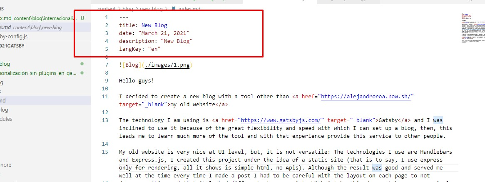
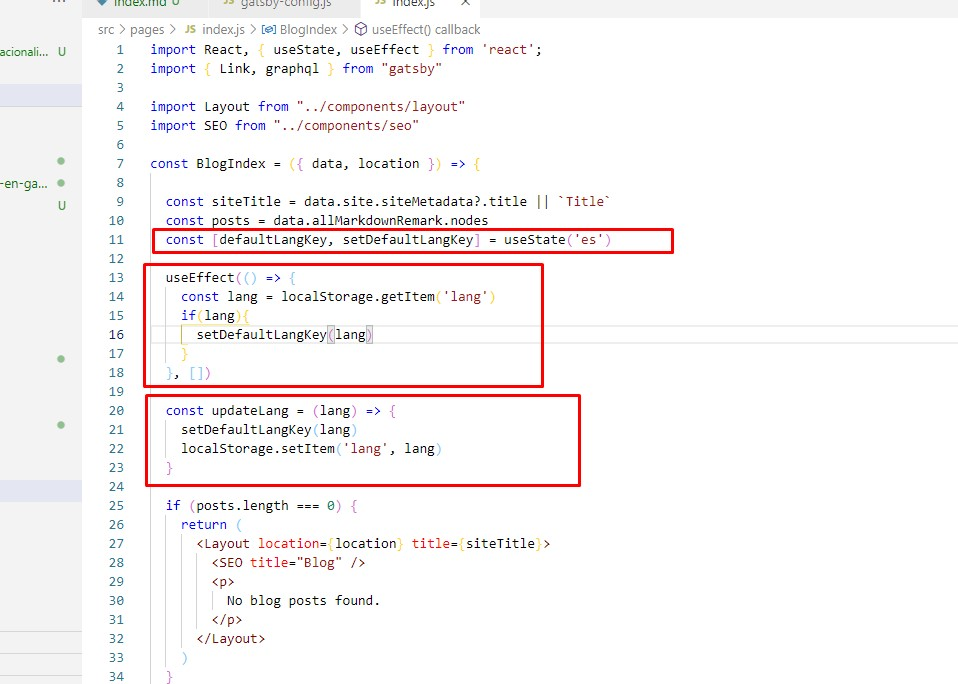
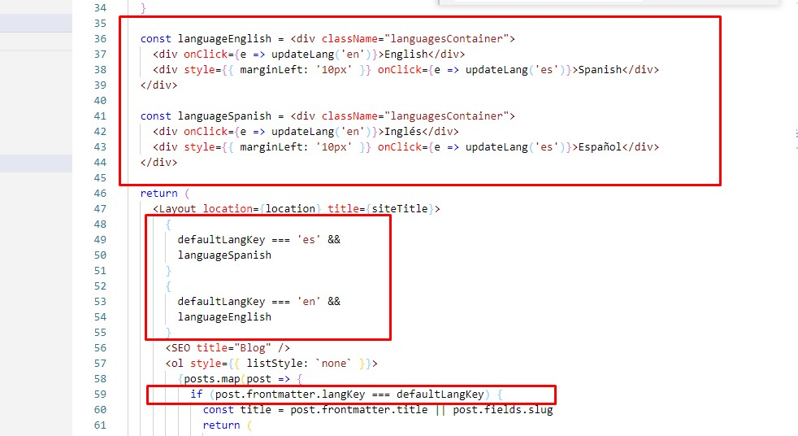
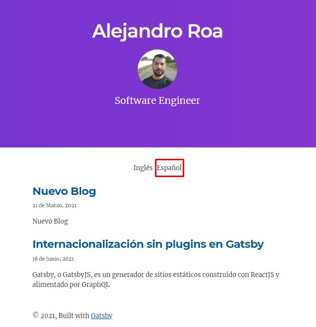
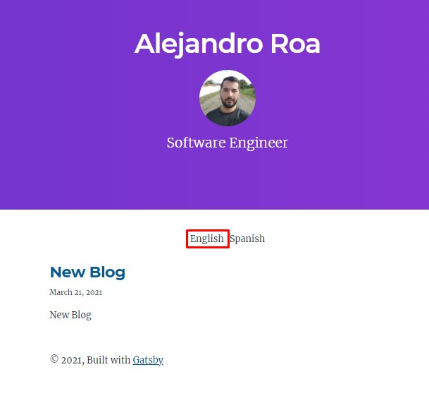
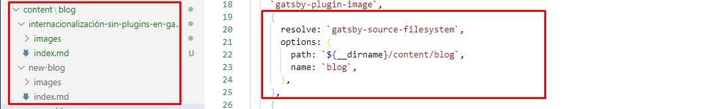
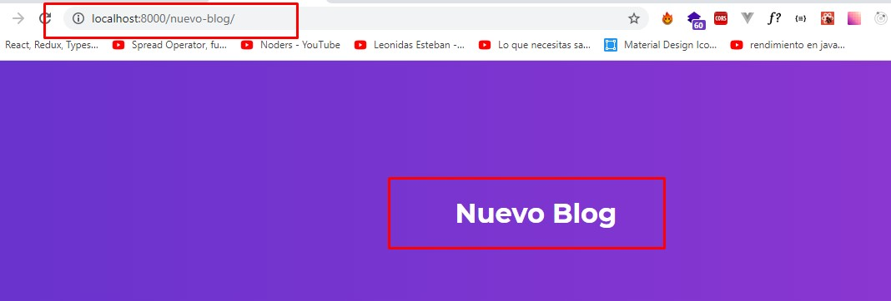
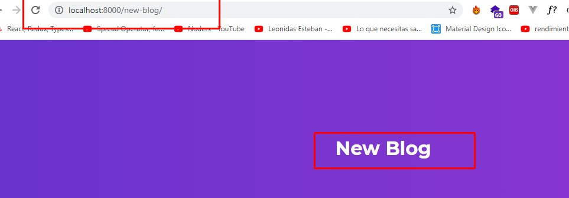

When I tried to create my blog with Gatsby I could understand that the ecosystem of the tool shows very strongly the use of plugins to implement quick very strongly the use of plugins to implement quick solutions. 

However, from experience before using any plugin or library it is good to test if it is what we really we need. If it is easy to understand and maintain there would be no problem but, what happens when these solutions are more complex than what you perceive as necessary?

In my particular case I needed to implement internationalization, keeping in mind that I didn't want to use any Headless CMS, I wanted to implement Markdown to create the content "locally", I found some alternatives like **gatsby-plugin-i18n**, **react-intl** and **i18next**:  **gatsby-plugin-i18n**, **react-intl** and **i18next**.  These options help to translate the content at component level, I did not find an easy way to translate the content generated from **.md** files.

After trying several things I went another way, trying to customize on my own what I needed but with the objective of keeping the flow of the solution simple, understanding first that I had to create per post the content in English and Spanish.

So:

1. Create the project and define the architecture, in my case I use <a href="https://www.gatsbyjs.com/starters/thundermiracle/gatsby-simple-blog" target="_blank">Gatsby simple blog</a>

2. Understand how **Markdown** and **GraphQL** work to be able to take metadata and use it when I want to show my content in the correct language, in this case I have created a key called langKey that defines if it is Spanish (es) or English (en).  

**Note:** To enlarge the image you can click on it.

3. Understand that I am going to change state at the component level and that this state must be persisted (language change) and then apply certain processes: 

**a)** Configure a local state that allows me to show the appropriate labels for each option available to the user. **b)** Decide within the loop that shows the posts the appropriate way of validation. **c)** Persist the state so that, when viewing the detail of the posts and browsing the site, the language previously selected by the user is maintained, here I used localStorage.

This configuration allows me to list in my index the posts depending on their language

We must also take into account the **urls** that are formed when we want to display the content, as it will be important for the **SEO**. In this case, Gatsby implicitly creates these paths depending on the configuration we give it in the **gatsby-config.js** file.

In this case the default template we are using applies a plugin called **gatsby-source-filesystem** that allows to internally configure this path.

With this we have ready our blog in **Gatsby** customized to apply **internationalization** when we use **Markdown** in an easy to do and maintain way.

I hope you find it useful.

Greetings!
