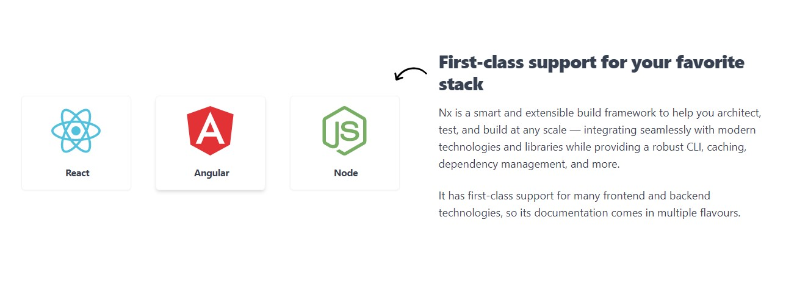
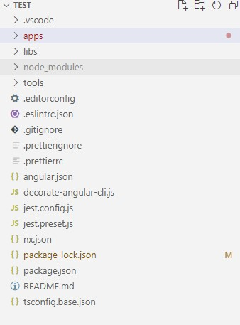
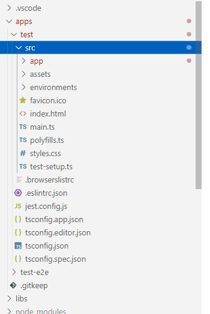
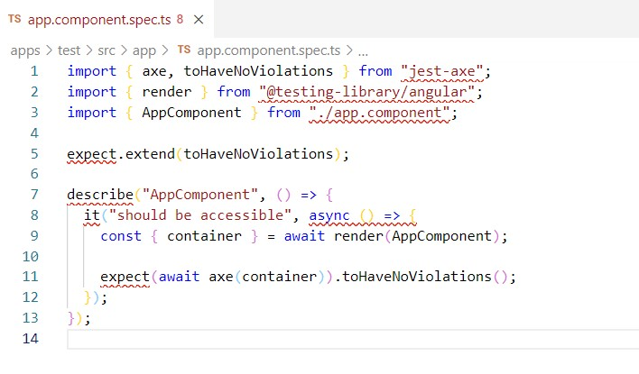
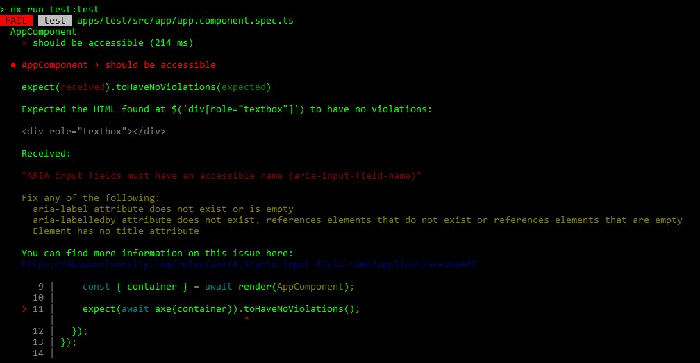
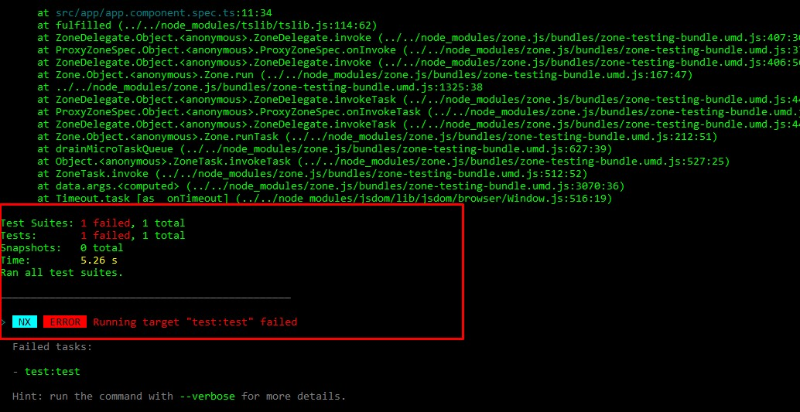

The accessibility tests complement the unit tests at frontend level, since they verify if the components that we have implemented work correctly for our project, but they do not verify if these components are written correctly. 

<a href="https://nx.dev/" target="_blank">Nx</a> is a technology that helps us to run this type of tests on frontend tools such as React.js or Angular. Nx has its own proposed architecture for each of the options present in order to facilitate integration with test tools.

To run the accessibility tests we will use:

<a href="https://github.com/nickcolley/jest-axe" target="_blank">Jest-Axe</a>

<a href="https://testing-library.com/" target="_blank">Testing Library</a>

We are going to use NX to implement our accessibility tests based on Angular:

1. **We globally installed the Nx cli:** 

```
npm i -g nx
```

2. **We install npx globally**

```
npm install -g npx
```

3. **We install our project**
```
npx create-nx-workspace --preset=angular
```

4. **We add jest-axe, its types and testing library in package.json**

dependencies:
```
"@testing-library/dom": "^7.24.1",
"@testing-library/user-event": "^12.0.11",
```

devDependencies:
```
 "@testing-library/angular": "^10.3.1",
 "@testing-library/jest-dom": "^5.11.0",
```

5. **We run**
```
npm install
```


6. **We visualize the project architecture:** At the Angular level we can see that it has a project organization a little different than when we use Angular-cli, but it is not difficult to understand. Each file has its default settings, for the moment we are not going to study each of them, we are interested in seeing where our components are. In the second level of the project we are going to find our Angular as we know it.





7. **We create our test file:** app.component.spec.ts and write our accessibility test:



8. **the toHaveNoViolations() function** helps us to validate if the html we have written is correct, we don't have to do anything else. It can be customized, but it is not necessary. 

**Important:** Don't be scared by the red lines that my code editor shows, something is broken, but it's not the code.

9. **We run our accessibility test,** in this case I have implemented two inputs, one correct and one incorrect, so the test must have a failure:
```
npm run test
```




10. **Accessibility rules:** Jest-Axe is inspired by axe-core which, in its Github repository explains the accessibility rules explicitly, you can see the correct and incorrect ways to implement each component. On the right side you can see the ACT-Rules column and there the link that redirects you to the examples by element. You can see that repository <a href="https://github.com/dequelabs/axe-core/blob/develop/doc/rule-descriptions.md" target="_blank">HERE</a>

11. **The project that we are testing** you can download it <a href="https://github.com/Alejandro04/NxAngular" target="_blank">HERE</a>

I hope you find it useful, greetings!
