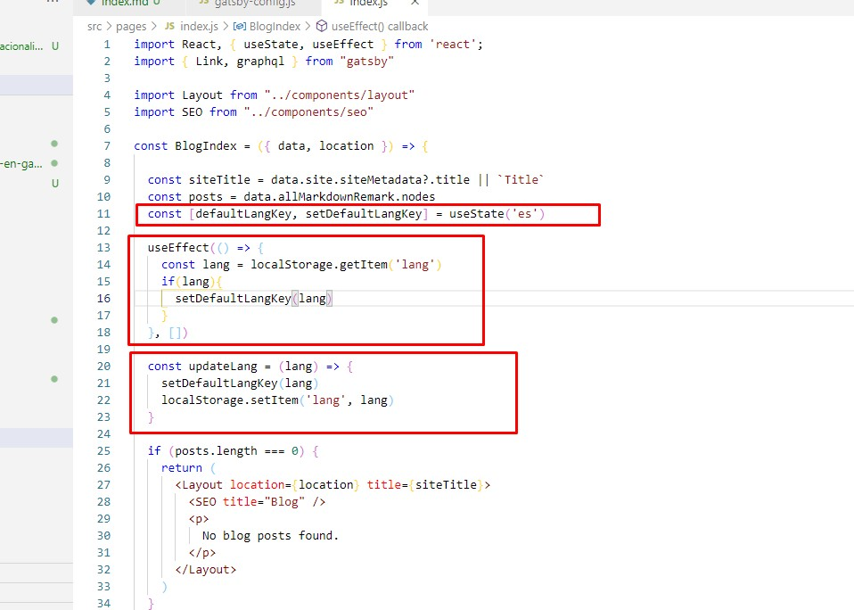
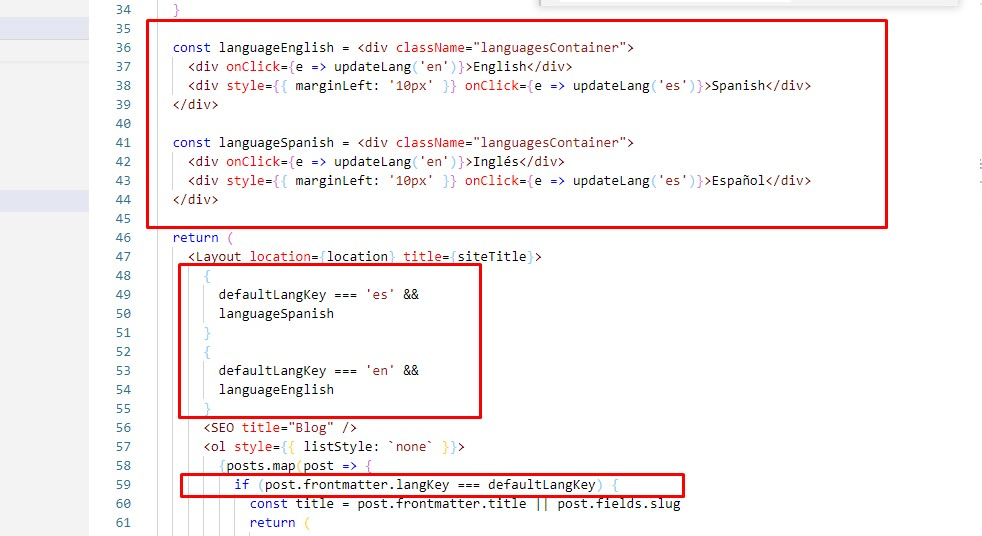
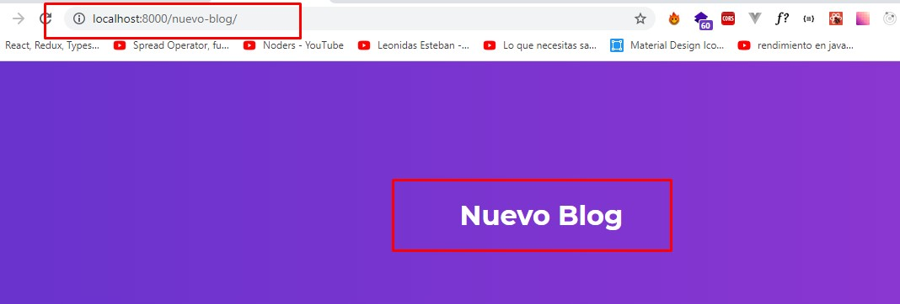

Al intentar crear mi blog con Gatsby pude comprender que el ecosistema de la herramienta muestra 
con mucha fuerza el uso de plugins para implementar soluciones rápidas. 

Sin embargo, por experiencia antes de usar algún plugin o librería es bueno probar si es lo que realmente
necesitamos. De ser fácil de comprender y mantener no habría problema pero, ¿qué sucede cuandos estas soluciones son más complejas de lo que percibes como necesario?

En mi caso particular necesité implementar internacionalización, teniendo en cuenta que no quería usar ningún Headless CMS si no implementar Markdown para crear el contenido de forma "local", encontré algunas alternativas como: **gatsby-plugin-i18n**, **react-intl** y **i18next**. Si bien es cierto que estas opciones ayudan a traducir el contenido a nivel de componentes, no encontré una forma fácil de traducir el contenido generado desde archivos **.md**

Después de probar varias cosas me fuí por el camino verde, intentar customizar por mi cuenta lo que necesitaba pero con el objetivo de mantener sencillo el flow de la solución, entendiendo primero que 
debía crear por post el contenido en inglés y español.

Entonces, comenzamos:

1. Crear el proyecto y definir la arquitectura, en mi caso uso <a href="https://www.gatsbyjs.com/starters/thundermiracle/gatsby-simple-blog" target="_blank">Gatsby simple blog</a>

2. Entender cómo funciona **Markdown** y **GraphQL** para poder tomar metadatos y usarlos al momento de querer mostrar mi contenido en el idioma que desee, en este caso he creado un key llamado langKey que define si es español (es) o inglés (en)  

**Nota:** Para ampliar la imágen puedes dar click sobre la misma.

3. Comprender que voy a cambiar de estado a nivel de componentes y que ese estado debo persistirlo (cambio de idioma) entonces, aplicar ciertos procesos: 

**a)** Configurar un estado local que me permita mostrar los labels adecuados para cada opción disponible para el usuario. **b)** Decidir dentro del loop que muestra los post la forma adecuada de validación. **c)** Persistir el estado para que, al ver el detalle de los post y navegue por el sitio se mantenga el idioma que seleccionó previamente el usuario, aquí usé localStorage.

Esta configuración da como resultado que pueda listar en mi index los post dependiendo del idioma

También debemos tener en cuenta las **urls** que se forman al querer visualizar el contenido, ya que será importante para el **SEO**. En este caso, Gatsby crea implicitamente estas rutas dependiendo de la configuración que le demos en el archivo **gatsby-config.js**

En este caso el template por defecto que estamos usando aplica un plugin llamado **gatsby-source-filesystem** que permite configurar internamente esta ruta.

Con esto tenemos listo nuestro blog en **Gatsby** customizado para aplicar **internacionalización** cuando usemos **Markdown** de una forma fácil de hacer y mantener.

Espero que les sirva.

Saludos!
