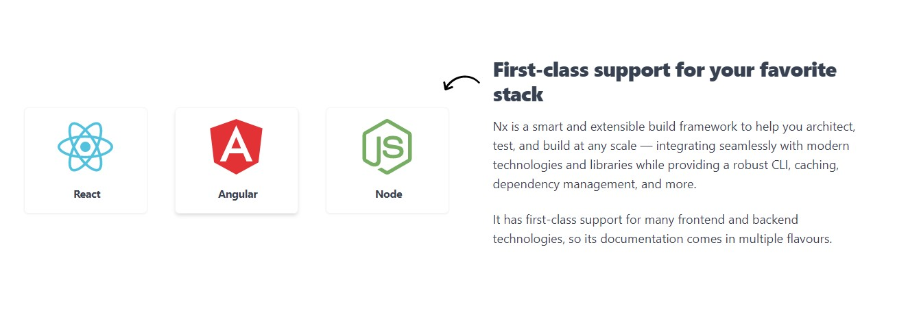
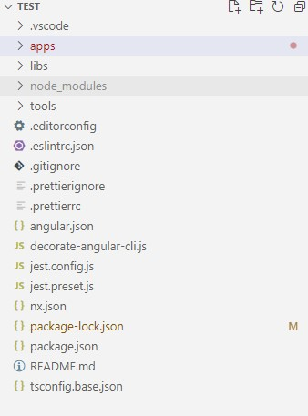
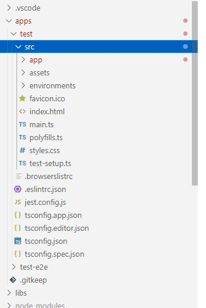
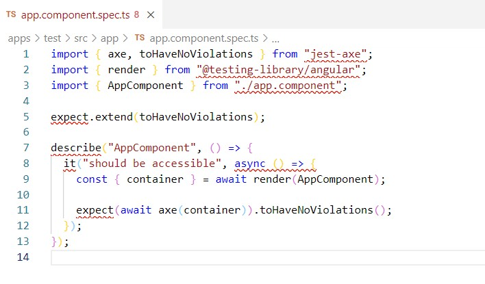
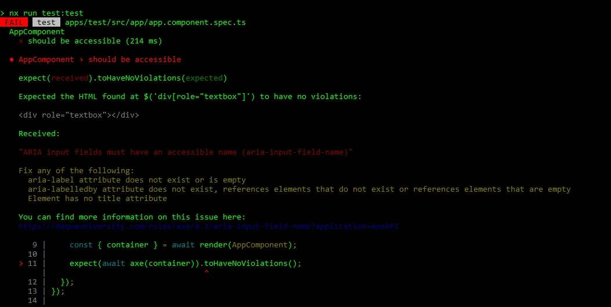
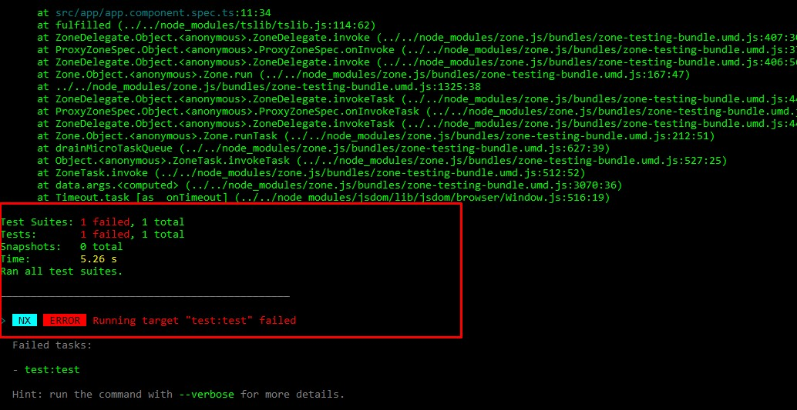

Las pruebas de accesibilidad vienen a complementar los test unitarios a nivel de frontend, ya que estas permiten verificar si los componentes que hemos implementado funcionan correctamente para nuestro proyecto, pero no alcanzan a verificar si dichos componentes están escritos correctamente. 

<a href="https://nx.dev/" target="_blank">Nx</a> es una tecnología que nos ayuda a ejecutar este tipo de pruebas sobre herramientas en el frontend ya sea React.js o Angular. Nx tiene su propia arquitectura propuesta para cada una de las opciones presentes en función de facilitar la integración con herramientas de test

Para ejecutar los test de accesibilidad vamos a usar:

<a href="https://github.com/nickcolley/jest-axe" target="_blank">Jest-Axe</a>

<a href="https://testing-library.com/" target="_blank">Testing Library</a>

Vamos a usar NX para implementar nuestros test de accesibilidad en función de Angular:

1. **Instalamos de forma global el cli de Nx:** 

```
npm i -g nx
```

2. **Instalamos de forma global npx**

```
npm install -g npx
```

3. **Instalamos nuestro proyecto**
```
npx create-nx-workspace --preset=angular
```

4. **Agregamos jest-axe, sus tipos y testing library en el package.json**

dependencies:
```
"@testing-library/dom": "^7.24.1",
"@testing-library/user-event": "^12.0.11",
```

devDependencies:
```
 "@testing-library/angular": "^10.3.1",
 "@testing-library/jest-dom": "^5.11.0",
```

5. **Ejecutamos**
```
npm install
```


6. **Visualizamos la arquitectura del proyecto:** A nivel de Angular podemos ver que tiene una organización del proyecto un poco distinta que cuando usamos Angular-cli, pero no es difícil de entender. Cada archivo tiene sus configuraciones por defecto, por los momentos no vamos a estudiar cada uno de ellos, nos interesa es ver dónde están nuestros componentes. En el segundo nivel del proyecto vamos a encontrar nuestro Angular tal cual como lo conocemos.





7. **Creamos nuestro archivo para test:** app.component.spec.ts y escribimos nuestra prueba de accesibilidad:



8. **La función toHaveNoViolations()** nos ayuda a validar si el html que hemos escrito es correcto, no tenemos que hacer absolutamente más nada. Si que se puede customizar, pero no es necesario. 

**Importante:** No se asusten con las lineas rojas que muestra mi editor de código, algo está roto, pero no es el código.

9. **Corremos nuestro test de accesibilidad,** en este caso he implementado dos inputs, uno correcto y otro incorrecto, por lo tanto la prueba debe tener una falla:
```
npm run test
```




10. **Reglas de accesibilidad:** Jest-Axe es inspirado en axe-core el cual, en su repositorio de Github explica las reglas de accesibilidad de forma explicita, puedes ver las formas correctas e incorrectas de implementación de cada componente. Del lado derecho pueden ver la columna ACT-Rules y allí el link que los redirige a los ejemplos por elemento. Ese repositorio lo pueden ver <a href="https://github.com/dequelabs/axe-core/blob/develop/doc/rule-descriptions.md" target="_blank">AQUÍ</a>

11. **El Proyecto que estamos probando** pueden descargarlo <a href="https://github.com/Alejandro04/NxAngular" target="_blank">AQUÍ</a>

Espero que les sirva, saludos!
