NGRX viene de Redux pero acoplado para Angular, incluso, la forma de comportarse e implementarlo es similar: Todo parte de la acción del usuario, la acción pasa por un reducer (una función pura, que recibe el actual estado y devuelve el nuevo estado) se almacena dicho estado (dato) en el store, del store pasa al componente deseado y muestra el resultado en la vista y/o ejecuta otra acción.

Ejemplo: Vamos a compartir datos de idiomas a través del store, es decir, que desde un componente se quiera seleccionar los idiomas disponibles desde un botón y que también lo haga desde otro componente.

Pasos a seguir: 

1. Si estás en un proyecto nuevo debes tener en cuenta la instalación de NgRx, ejecutando desde la consola:

**npm install @ngrx/store — save**

2. Creamos un archivo dentro de app llamado simple.reducer.ts (a medida que el proyecto crece es bueno crear un folder con todos los reducers dentro del mismo)

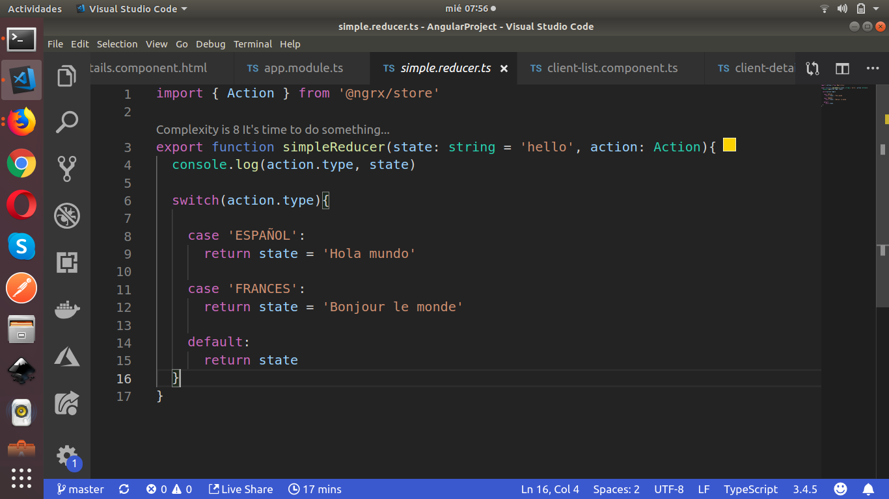

Nuestro reducer se compone de lo siguiente:

**Importar el módulo Action:** 

Este modulo nos permite definir cada acción individual que el usuario ejecuta y que viene del componente.

Crear nuestra función reducer, en este caso llamada simpleReducer: va pasar a través del mismo dos parámetros, la primera es el estado inicial que en este caso es un mensaje ‘hello’ (es lo que se va mostrar al cargar el componente cuando acceda a esta función) aquí el valor puede ser cualquiera o incluso null o vacio. Y la segunda es un objeto tipo acción (el que importamos).

Configuramos un switch case y dependiendo del tipo de acción va retornar un nuevo estado, en el caso de no cumplirse ninguna condición devuelve el estado actual.

Adicional a esto, debemos indicarle a nuestro proyecto el reducer que va usar, en este caso va ser solo uno pero en la mayoría de proyectos se usan varios reducers, por lo que se debe configurar alguna función que los combine y se los pase al proyecto. Este no es el caso, entonces hacemos lo siguiente:

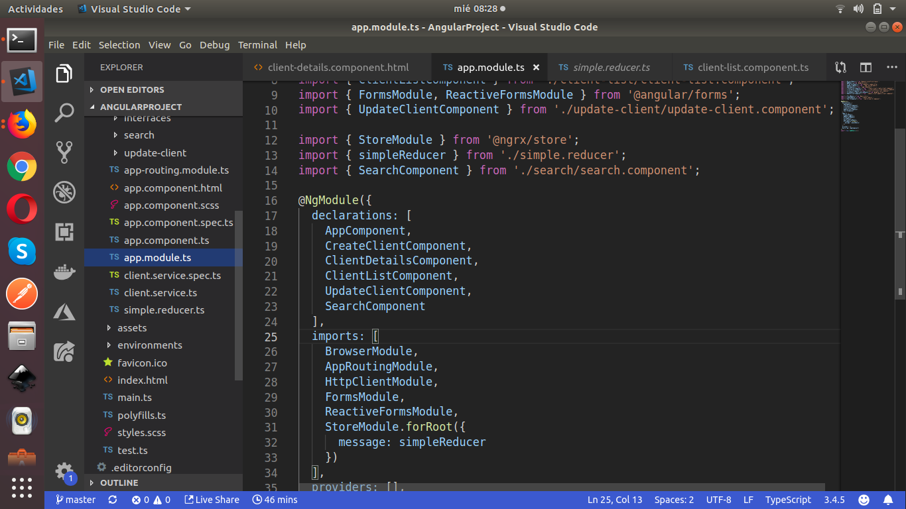

En el archivo app.module.ts importamos el store y nuestro reducer (lineas 13 y 14 respectivamente) y en la linea 31 para este caso, configuramos nuestra tienda en el proyecto.

Ahora bien, vamos acceder a nuestra tienda (action + reducer) desde dos componentes, la lista de clientes y el detalle del cliente:

Lista de clientes:

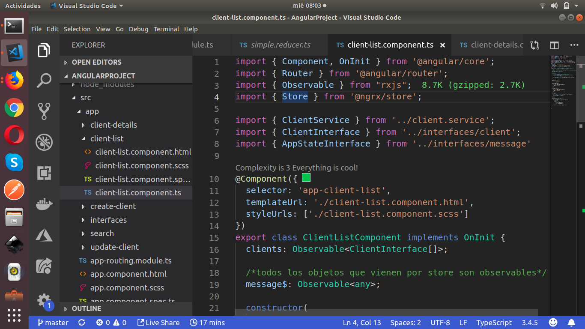

Vamos a enfocarnos en las lineas 4, 8 y 19

En la linea 4 llamamos al método Store, el cual viene de @ngrx/store y nos va permitir el uso de la tienda.

En la linea 8 importamos una interface que configuramos para nuestro ejemplo, donde solo refleja el item mensaje.

En la linea 19 configuramos el item mensaje tipo observable, además de permitirle mostrar cualquier valor con <any> aunque para este caso, aplica mejor <string>

Nuestra interfaz es la siguiente:

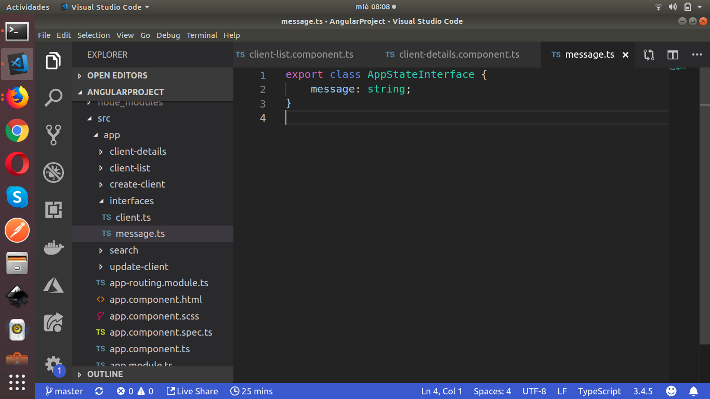

Configuración nuestra vista para acceder al store:

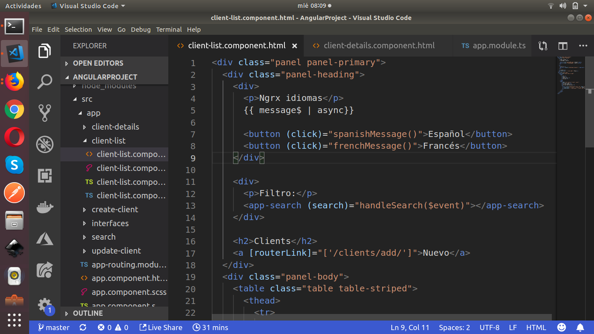

Desde la linea 4 a la 8 podemos ver el nuevo comportamiento de nuestra vista, simplemente accedemos a nuestro store por medio de dos funciones (que tenemos que definir en nuestra clase) e imprimimos nuestro mensaje en pantalla.

Las funciones que debemos configurar para enviar el cambio de estado a nuestro store son:

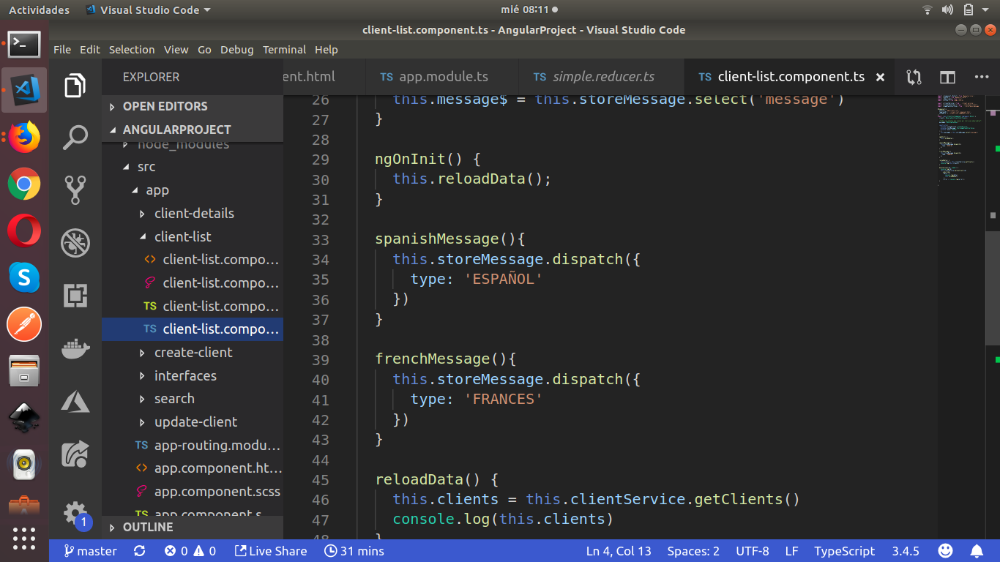

La función spanishMessage() ejecuta un dispatch con el tipo de acción que vamos a ejecutar dentro de nuestro store, al igual que la funcion frenchMessage()

Cada vez que el usuario presione el botón del idioma a mostrar, se va reflejar de forma reactiva en nuestra vista teniendo en cuenta que pasa por el store y que cualquier otro componente puede acceder al mismo con unas simples configuraciones. Eso lo veremos en las pantallas siguientes:

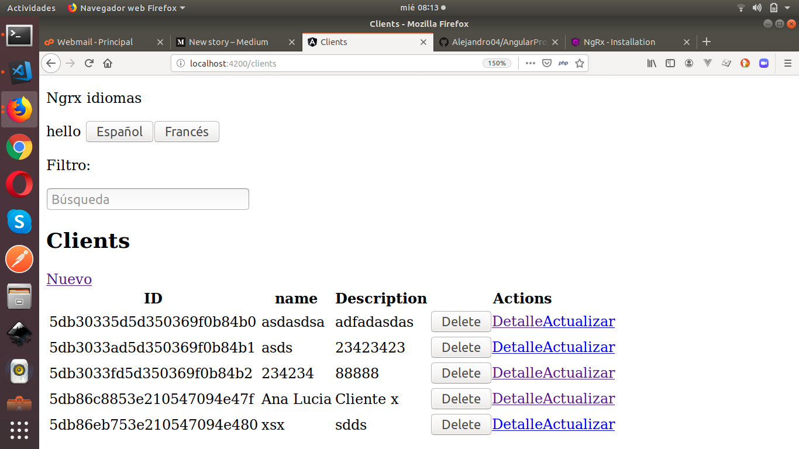

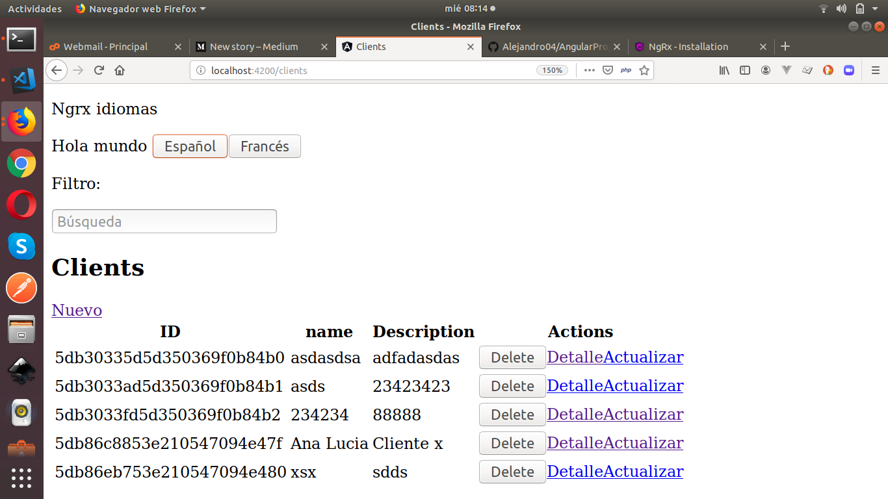

**Acceder a la misma tienda desde otro componente:** detalle del cliente. (que en el fondo es lo que necesitamos, acceder desde distintos componentes a una misma tienda o un mismo estado para modificarlo o consultarlo)

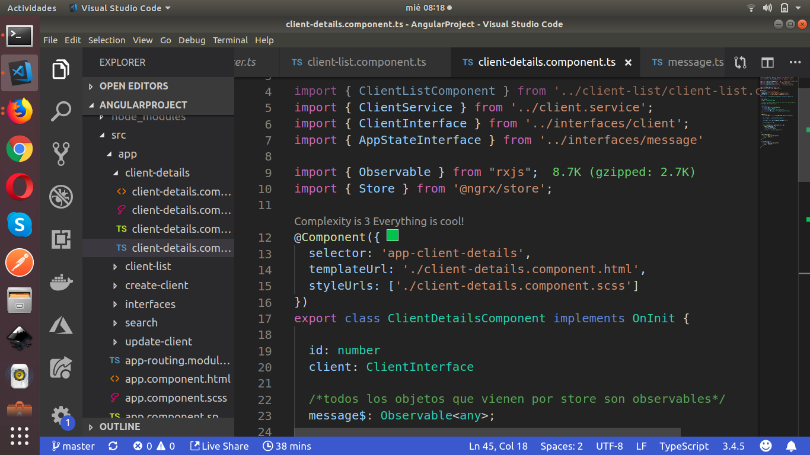

Como vemos, en las lineas 7, 10 y 23 aplica el mismo proceso, importar la interface a usar, el store y configurar nuestro item message tipo Observable.

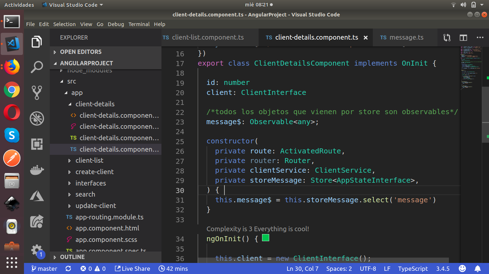

En la linea 31 accedemos a nuestra tienda a traves de nuestro item message, recordando que al configurarlo desde el constructor vamos a tener nuestor mensaje disponible al cargar el componente.

Agregamos los métodos que hemos usado en el componente de lista de clientes como se muestra en la siguiente imagen:

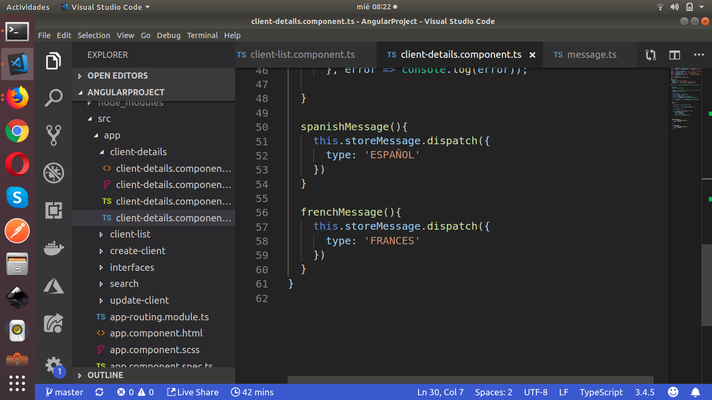

Finalizando nuestra vista:

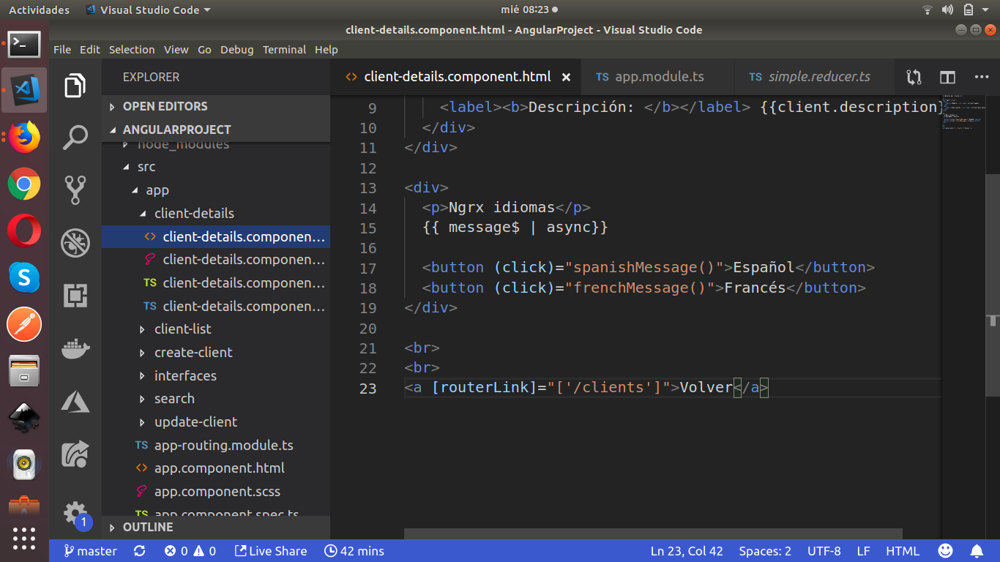

Usamos la tienda de la misma forma en cada componente, pero esto aplica para el ejemplo, existen formas complejas y distintas dependiendo de cada situación.

Resultado:

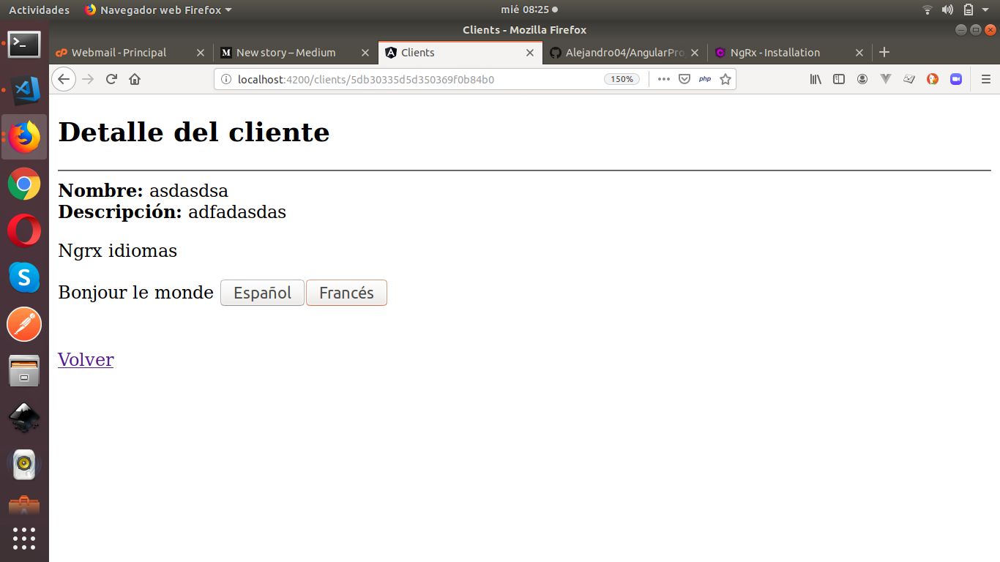

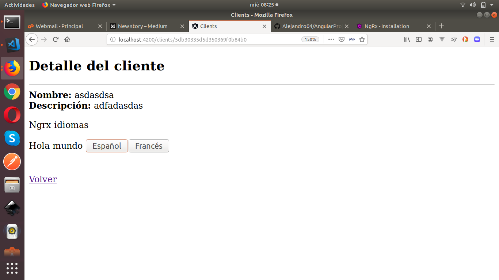

<a href="https://github.com/Alejandro04/AngularProject" target="_blank">Clonar projecto</a>

Espero que te sirva un poco este post. Saludos!

