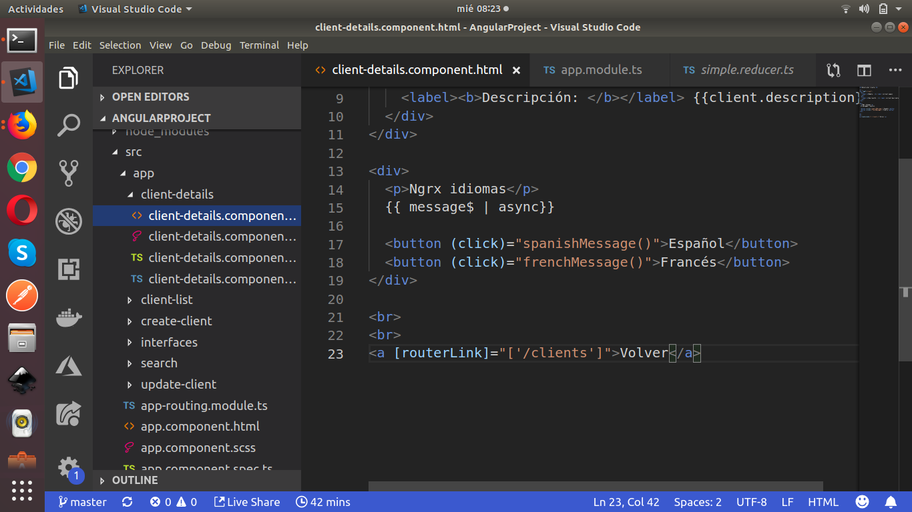

NGRX comes from Redux but coupled to Angular, even the way to behave and implement it is similar: Everything starts from the user action, the action goes through a reducer (a pure function, which receives the current state and returns the new state) is stored in the store, from the store it goes to the desired component and displays the result in the view and/or executes another action.

Example: we are going to share language data through the store, that is, from a component you want to select the available languages from a button and also do it from another component.

Steps to follow: 

1. If you are in a new project you must take into account the installation of NgRx, running from the console:

**npm install @ngrx/store — save**

2. We create a file inside the app called simple.reducer.ts (as the project grows it is good to create a folder with all reducers inside it)

Our reducer consists of the following:

**Import the Action module:** 

This module allows us to define each individual action that the user executes and that comes from the component.

Create our reducer function, in this case called simpleReducer: it will pass through it two parameters, the first is the initial state that in this case is a message 'hello' (it is what will be displayed when loading the component when accessing this function) here the value can be any or even null or empty. And the second one is an action type object (the one we import).

We configure a switch case and depending on the type of action it will return a new state, in the case of not fulfilling any condition it returns the current state.

In addition to this, we must indicate to our project the reducer that will be used, in this case it will be only one but in most projects several reducers are used, so it must be configured some function that combines them and passes them to the project. This is not the case, so we do the following:

In the app.module.ts file we import the store and our reducer (lines 13 and 14 respectively) and in line 31 for this case, we configure our store in the project.

Now, we are going to access our store (action + reducer) from two components, the customer list and the customer detail:

Customer list:

Let's focus on lines 4, 8 and 19.

In line 4 we call the Store method, which comes from @ngrx/store and will allow us to use the store.

In line 8 we import an interface that we configure for our example, where it only reflects the item message.

In line 19 we configure the item message observable type, besides allowing it to show any value with <any> although for this case, <string> applies better.

Our interface is as follows:

Configuration of our view to access the store:

From line 4 to line 8 we can see the new behavior of our view, we simply access our store by means of two functions (that we have to define in our class) and print our message on the screen.

The functions that we must configure to send the change of state to our store are:

The function spanishMessage() executes a dispatch with the type of action that we are going to execute inside our store, as well as the function frenchMessage().

Every time the user presses the button of the language to show, it is going to be reflected in a reactive way in our view taking into account that it goes through the store and that any other component can access it with some simple configurations. We will see this in the following screens:

**Access the same store from another component:** customer details (which is basically what we need, access from different components to the same store or the same status to modify or consult it).

As we can see, in lines 7, 10 and 23 the same process applies, import the interface to use, the store and configure our item message type Observable.

In line 31 we access our store through our item message, remembering that when configuring it from the constructor we will have our message available when loading the component.

We add the methods that we have used in the customer list component as shown in the following image:

Ending our view:

We use the store in the same way in each component, but this applies to the example, there are complex and different ways depending on each situation.

Result:

<a href="https://github.com/Alejandro04/AngularProject" target="_blank">Clone project</a>

I hope you find this post helpful. Greetings!

